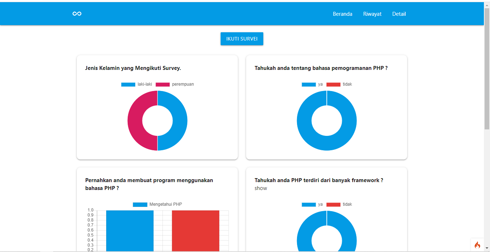
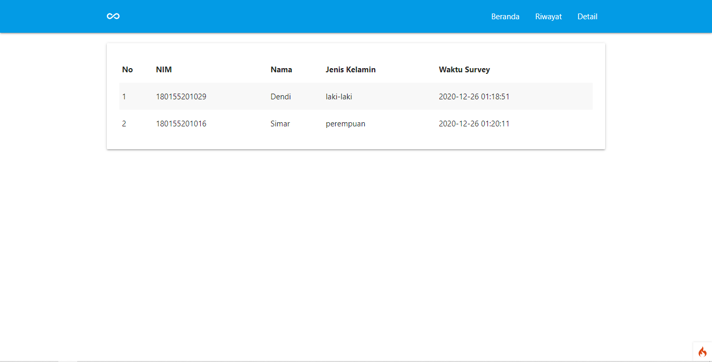
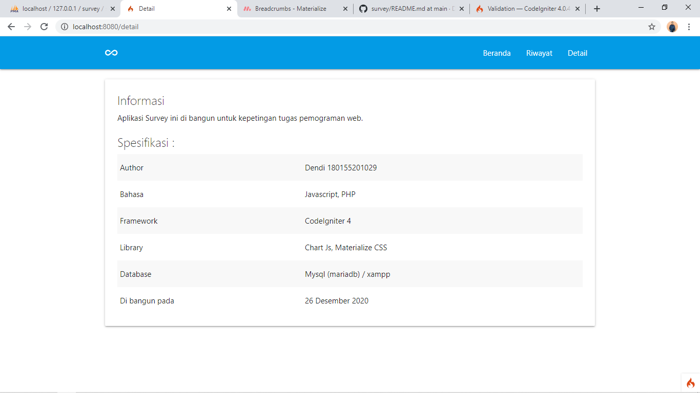

## Survey

Aplikasi ini merupakan aplikasi yang dikembangkan untuk menyelesaikan tugas pemograman web.
Aplikasi di bangun dengan bahasa `php` dan memanfaatkan framework `Codeigniter 4`. Styling menggunakan css dan menggunakan libraruy `materialiaze`. Sedangkan untuk chart atau grafik, menggunakan library `chart js`.

## Running

1. clone aplikasi dengan menggunakan perintah
   `git clone`
2. Jalankan server mysql.
3. Import database dengan nama `survey.sql`.
4. Running sistem dengan mengetik
   `php spark Serve`

Happy Coding 🤣

## Interface

